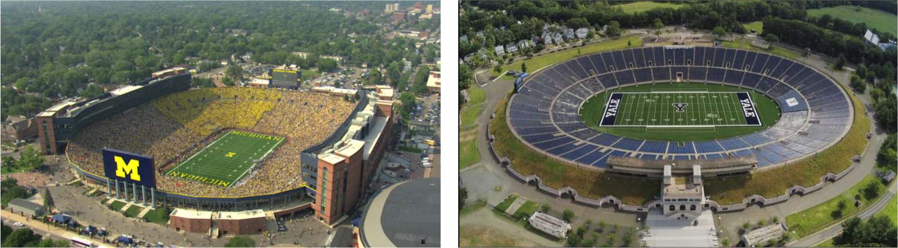

# Stadium Roof

Estimate the energy requirements for the HVAC (heating, ventilation, and air-conditioning) system serving a very large indoor stadium. I often described the project in terms of adding a roof to Bryant-Denny Stadium, but any stadium or similar structure would suffice. Consider the Superdome in New Orleans: its interior volume is approximately 3,500,000 m^3^. Be sure to choose a structure that does not exist. For example, imagining Bryant-Denny with a roof is a great project, whereas calculating the energy needs of the Superdome is not.


## Human Comfort

Humans indoors find comfort in relatively narrow ranges of temperature and relative humidity, depending on season. Acheiving and maintaining a comfortable environment can an expensive undertaking. For easy proof, look at August and February utility bills. Expeditures related to HVAC make up a very large portion of worldwide energy consumption. Efficiently maintaining the proper temperature is challenging; controlling the humidity can be energy-intensive. When the humidity is too low, people suffer from cracked skin, nosebleeds, allergy attacks, and general discomfort. High humidity promotes the growth of mold, which can lead to very serious chronic health problems, even death.


## Project Details

1. Establish your stadium geometry.
1. Account for energy sources and sinks:
    a. People generating heat and releasing water vapor
    a. Heat transfer through the roof, especially solar irradiation
    a. Heat transfer through the walls. Use a reasonable facsimilie to represent the walls. With a stadium that is relatively open underneath (like BDS), the walls would be the concrete structure immediately under the seats. From Figure \@ref(fig:bighousebowl), it is easy to see that a sunken stadium like Michigan's "Big House" or one with earthen walls, like those of the Yale Bowl, will have much different heat transfer characteristics than a stadium that is completely above grade.  

        ```{r, bighousebowl, fig.cap = 'Michigan Stadium (L), and the Yale Bowl', echo=FALSE}
          
        ```

    a. Keep in mind, an HVAC systems take in air, condition it, then return it to the occupied space. It takes energy to motivate air to move. Moreover, people generally do not like feeling moving air when they are indoors. 


## Calculations

1. Develop worst-case scenarios for heating and cooling your stadium, eg, August and February days and nights, and calculate required rates of energy transfer. Outdoor conditions can be found in an almanac or NOAA climactic data. 
1. Calculate the power required for an air conditioner or heat pump to meet cooling demands. Determine the cost of said power.
1. Calculate power requirements for a heat pump to satisfy heating demands. Compare heat pump power and cost to those of heating by natural gas and heating by pure electric Joule heating.
1. Calculate the time it takes your HVAC system to reach comfortable conditions, assuming the indoor environment is the same as outdoor ambient conditions. 

## Report

_coming soon_


## Resources

_coming soon_
