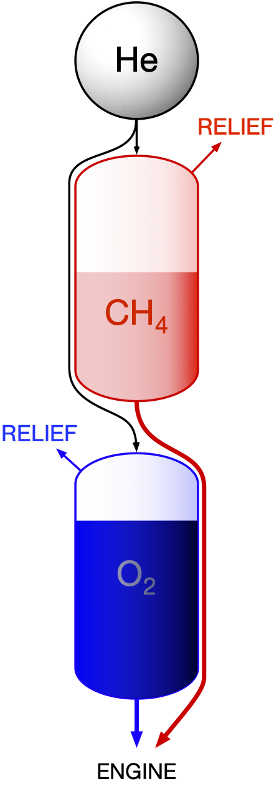

# Rocket Cryogenic Storage


Storing Cryogenic liquids is a challenging endeavor.
Cryogenic liquids have boiling points that are far below ambient temperature. 
When storing them, a major challenge is reducing boil-off. 
The cryogen is under saturation conditions, so any heat transfer into the tank increases the vapor fraction of the cryogen. This is a serious concern for applications that require liquid cryogen (as opposed to very cold gas). 


```{r rocket-fuel, out.width='25%', fig.align='center', fig.cap = "Simple depiction of a rocket fuel system", cache=TRUE, message=FALSE, echo=FALSE}

```


If the cryogen is stored in a rigid tank, pressure increases until the tank eventually ruptures. A mechanically robust tank is an option, but a tank robust enough to survive the pressure increase would be extremely heavy. Normally, cryogenic stoorage tanks (dewars) are vented, but that means lost cryogen. 
  
You are charged with designing the fuel system for a rocket fueled by liquid methane (LMG), with liquid oxygen (LOX) oxidizer. 
We’ve already determined how much fuel and oxidizer are required to complete the mission. Your major concern is the loss of LMG and LOX while the rocket sits on the pad. You will be launching from the New Mexico desert in mid-June, and the rocket may sit on the pad for up to 2 hours after fueling. 
Because you’re so good at thermodynamics, you know you have several options at your disposal:   

1. Increase tank pressure.
1. Insulate the tanks.
1. Load extra cryogens and vent the excess. 
1. Other clever ideas I didn't realize.

## Project   

Develop a calculator that will compute optimum tank dimensions given user-defined constraints and requirements. 

### Possible Inputs

1. Required liftoff masses of both fuel and oxidizer, or either fuel or oxidizer.
1. Maximum diameter, length, volume, or mass of each tank.
1. Oother parameters you find important.

### Outputs

1. Dimensions of both tanks.
1. Specify initial masses of LOX and LMG to be loaded into each tank. This is the amount before any boiloff begins. 
1. Specify operating pressure of each tank. 
1. Specify the insulation type and its thickness. 
1. Alert user if they have specified a set of requirements than cannot be met.


## Constraints, Requirements, Complications

1. It's a rocket. Low weight is holy and just. 
1. Consider the wisdom of venting a lot of fuel and oxidizer in the same genral area.
1. Heat transfer 

## Bonus

Account for the mechanical strength of the tank material in your calculations.


## Resources

1. You will need property data beyond what is in your textbook. Feel free to use other texts, ASHRAE Handbooks, NASA [@mcbride_nasa_2002], [@noauthor_nasa_nodate] and DOD [@noauthor_defense_nodate] libraries, etc. Mathematica (UA has a site license) has a very nice thermodynamic properties function. The NIST [@linstrom_nist_2019] Chemistry WebBook may be a good option. Find it at \url{webbook.nist.gov}. CoolProp [@bell_pure_2014] is a popular open-source thermodynamic property calculator that works with platforms like Python, Julia, Python, Excel, MATLAB, Maple, and at least a dozen others. 

2. Heat transfer into a liquid is aalways higher than heat transfer to a vapor. Boiling liquids provide some of the highest heat transfer rates possible. I can point you to dozens of great sources for information about the heat transfer of fluids changing phase. 
